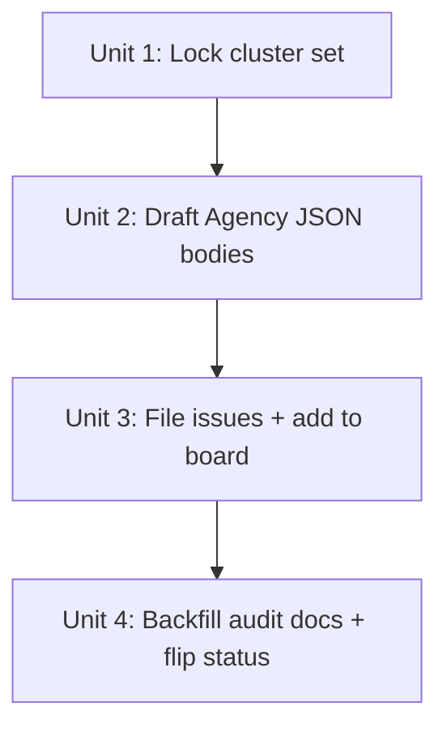

# refactor: A11y audit cross-surface synthesis + file fix-issues to Agency board

## Overview

This is the planning artifact for issue #18 — the Unit 7 synthesis pass of the parent text-styling audit plan (`docs/plans/2026-04-20-001-refactor-text-styling-audit-plan.md`). Both upstream triage units are complete: lesson-pages (#14, closed) and marketing/dashboard (#17, closed). Both audit docs hold their structured findings tables. One P0 (L-1, code-copy focus visibility) has already shipped as #26, leaving 12 P0/P1 findings and 3 cross-surface (X-) patterns to be collapsed into a minimal set of Agency-sized GitHub issues, the issue numbers backfilled into both audit docs, and both docs flipped to `status: complete`.

The work is **judgment-heavy bookkeeping**, not implementation. No `src/` is touched by this plan. Per the parent issue body, this is **USER-OWNED — do not dispatch to Agency.** The fix issues this plan produces are Agency-shippable (they live on the project board at `Ready for Planning`); the synthesis pass that produces them is not.

## Problem Frame

The two audit docs are the durable evidence record of the text-styling/a11y baseline at site commits `065ed99` (lesson) and `b089512` (marketing/dashboard). Their findings tables identify what should change and where, but each row is a *finding*, not a unit of work. To hand the work to Agency cleanly, findings must be:

1. Clustered so that each shipped issue touches one root cause and ≤3 files (the Agency-sized guardrail).
2. Cross-surface findings (X-1, X-2, X-3) collapsed into a single consolidating issue per pattern — that is the highest-leverage shape the audit produces.
3. Filed in the Agency JSON envelope format (`📋 **Plan**` header + `<!-- agency:plan-json -->` block with `problem`/`requirements`/`where`/`tests`/`acceptanceCriteria`/`antiRequirements`/`context`/`needsDesigner` fields) — the shape that shipped cleanly for #2, #8, #14, #15.
4. Placed on the Agency project board at the `Ready for Planning` column.

P2 findings (L-7, M-5) stay in the audit docs as backlog and are **not** filed.

## Requirements Trace

From issue #18 (carried forward verbatim):

- **AC-1.** Every P0 finding across both audit docs maps to exactly one GitHub issue.
- **AC-2.** Every new issue touches ≤3 files and has binary-testable AC (the Agency-sized guardrail).
- **AC-3.** Cross-surface issues explicitly list both surface files in their "Where" section.
- **AC-4.** P2 findings are NOT filed as issues (they stay in the audit docs as backlog).
- **AC-5.** Both audit docs have every P0's `Issue #` column populated and `status: complete` in frontmatter.
- **AC-6.** Every new issue appears on the Agency project board at `Ready for Planning`.
- **AC-7.** If total new issue count > 15, P1 clustering has been revisited to consolidate.

From the parent plan Unit 7 (`docs/plans/2026-04-20-001-refactor-text-styling-audit-plan.md`):

- **R7.** Each surface's findings become one or more Agency-sized GitHub issues.

## Scope Boundaries

- Out of scope: implementing any of the fixes themselves (the issues this plan files are the implementation handoff).
- Out of scope: re-running axe/Lighthouse, manual walks, or measuring typography (Units 2/3/5 collected, Units 4/6 triaged — the data is fixed at `065ed99` / `b089512`).
- Out of scope: editing the parent plan, the brainstorm, the `_template.md`, or `docs/audits/README.md`.
- Out of scope: closing the parent plan or marking it complete (it stays `active` until the produced issues ship).
- Out of scope: filing a tracking/epic issue or a wrap-up commit beyond the per-doc backfill.

## Context & Research

### Relevant docs and audit state

- **Parent plan:** `docs/plans/2026-04-20-001-refactor-text-styling-audit-plan.md` — Unit 7 (lines 309–343) is the canonical spec for clustering rules, board-add flow, and severity tiers (lines 84–87).
- **Audit docs (state at 2026-04-27):**
  - `docs/audits/2026-04-20-text-styling-lesson-pages.md` — `status: draft`, 8 L-rows (3 P0, 4 P1, 1 P2), 3 X-rows. `Issue #` column reads `#<tbd>` everywhere.
  - `docs/audits/2026-04-20-text-styling-marketing-dashboard.md` — `status: draft`, 5 M-rows (1 P0, 3 P1, 1 P2), 3 X-rows. `Issue #` column reads `#<tbd>` everywhere. Triage dispositions table at the bottom (lines 567–590) explicitly records every raw failure as `Absorbed into M-N`, `Absorbed into X-N`, `Dismissed`, or `Deferred — not dismissed`.
- **Audits README:** `docs/audits/README.md` — confirms the convention "findings from an audit are filed as GitHub issues and the issue number is recorded on the finding row."

### Issue-format prior art

- **Format used by all recent issues** (#2, #8, #14, #15, #17, #18, #24): `📋 **Plan** — <one-line summary>` followed by `<!-- agency:plan-json -->` and a fenced ```json``` block with the structured envelope. Inspected via `gh issue view 8` and `gh issue view 14` during planning.
- **Envelope fields** (verified against #8 and #14): `title`, `problem`, `requirements[].{id, priority, description}`, `where[].{path, description}`, `tests.{invariants[], behaviors[], issueType}`, `acceptanceCriteria[].{id, description}`, `antiRequirements[]`, `context` (free-form prose), `needsDesigner` (bool), `clarification_needed` (string, usually empty).
- **Issue title convention** (verified against the closed PR #27 / issue #26 for L-1): `<type>(<scope>): <description> (<finding-ID>)` — e.g. `fix(a11y): CodeCopyButton focus-visible rule (L-1)`.

### Project board details (verified at planning time)

- Board: **Agency** at `https://github.com/users/workshop-maybe/projects/3`
- Project node ID: `PVT_kwHOBBHmBc4BVKDg`
- Status field ID: `PVTSSF_lAHOBBHmBc4BVKDgzhQnxe8`
- "Ready for Planning" option ID: `e97f7b9c` (note: the field option name has a space, not a hyphen — the parent plan and #18 both wrote "Ready-for-Planning" informally)

### Already-shipped finding

- **L-1** (P0, code-copy focus visibility) shipped as **PR #27 / issue #26** (commit `26f7721`). Closed before this plan was written. Backfill in Unit 4 — do not re-file.

## Key Technical Decisions

- **Use the Agency JSON envelope format for every new issue, not plain prose.** Rationale: every Agency-bound issue in this repo uses this shape, the planner consumes it cleanly, and the parent plan's mention of "Problem → Requirements → Where → Tests → Acceptance → Anti-Requirements" refers to the *fields inside the envelope*, not to a separate prose format. Prior art: #2, #8, #14.

- **Set `needsDesigner: true` on issues that introduce or re-tune visible typography or spacing; `false` on landmark / labeling / redirect / utility-swap issues.** Rationale: the audit's typography and hierarchy fixes (X-1, X-2, X-3) involve real visual judgment calls; the labeling and redirect fixes are mechanical. Per-issue determination happens in Unit 2 drafting.

- **Cross-surface findings get ONE consolidating issue with both surface files named in `where[]` and AC covering both contexts.** Rationale: parent plan §Unit 7 — the shared root cause is the unit of fix, not the surface. Filing two issues for one `globals.css` token would cause Agency to plan the same change twice.

- **Merge candidates only when same root cause AND same files AND a unified AC reads cleanly.** Rationale: parent plan §Unit 7 explicit constraint. When in doubt, prefer two clean small issues over one larger merged issue — Agency-sized AC is a stronger signal than issue count.

- **P2 findings stay in the audit docs as backlog. Do not file.** Rationale: AC-4. Per parent plan §Key Technical Decisions, P2 = "polish / aspirational" — `L-7` (H1 line-height, auto-resolves with X-1) and `M-5` (`<main>` wrapper on `/404`/`/500`, axe best-practice not WCAG AA) qualify.

- **Each new issue is Agency-shippable; this synthesis plan is user-owned and is not dispatched.** Rationale: parent issue #18 explicit ("USER-OWNED — do not dispatch to Agency"). The fix issues themselves go to `Ready for Planning` on the Agency board for the planner to pick up.

- **Backfill `L-1 → #26` rather than re-file.** Rationale: PR #27 already shipped the focus-visible rule and closed #26. The L-1 row in the lesson-pages findings table currently reads `#<tbd>` and must be updated to `#26` as part of Unit 4.

- **Source-of-truth boundary: the audit docs are the canonical record; this plan does not duplicate finding text.** Rationale: every finding row is already complete (severity, criterion, file:line, expected, blast radius). The plan references findings by ID; the issue bodies quote the file:line anchors directly from the audit rows.

## Open Questions

### Resolved During Planning

- **Q: Use prose `Problem → Requirements → ...` format or Agency JSON envelope?** → Agency JSON envelope. Verified by inspecting #8 and #14 issue bodies — every recent issue uses the envelope.
- **Q: What is the project node ID and "Ready for Planning" option ID?** → `PVT_kwHOBBHmBc4BVKDg` and `e97f7b9c`. Verified with `gh project view 3` and `gh project field-list`.
- **Q: Does L-1 need a re-file?** → No. Backfill `#26` into the L-1 row.
- **Q: Are M-3's two surfaces (landing footer + lesson footer) one issue or two?** → One. M-3's blast radius is "landing page only (single instance in repo)" per the audit; the footer wordmark element exists at `src/pages/index.astro:287–295` and is not duplicated elsewhere.

### Deferred to Implementation

- **Q: Do X-1 + M-1 merge into one consolidating issue (heading hierarchy site-wide), or split (X-1 = H1 cascade across all surfaces, M-1 = dashboard H2/H3 collapse)?** → Decided in Unit 1 by the user. The candidate set assumes **merge**; splitting is a viable alternative if the user judges the dashboard fix has a meaningfully different shape.
- **Q: Do X-2 + X-3 merge into one `.prose-midnight` readability issue, or split (X-2 = body size, X-3 = measure cap)?** → Decided in Unit 1. Both touch the same `globals.css` block; the candidate set assumes **merge** because a single PR can land both with one combined AC.
- **Q: Is the H1 cascade root cause a Tailwind v4 preflight defect or a utility-generation defect?** → Diagnosed when X-1 ships, not in this plan. The issue body documents both possibilities; the implementer determines which during the fix.
- **Q: Does the project board exhibit the index-lag bug at filing time?** → Discovered live in Unit 3. Mitigation (delete-and-re-add) is documented; not pre-decided.
- **Q: Per-issue `needsDesigner` value?** → Determined in Unit 2 per the rule above (typography → true, labeling/redirect/utility → false).

## Implementation Units



- [ ] **Unit 1: Lock the cluster set**

**Goal:** Convert the candidate-cluster table below into a finalized list of issues to file, with each cluster's title, severity, source findings, and target files committed before any drafting begins.

**Requirements:** AC-1, AC-2, AC-3, AC-4, AC-7

**Dependencies:** None (both upstream triage docs are populated and #14 / #17 are closed).

**Files:**
- Read: `docs/audits/2026-04-20-text-styling-lesson-pages.md`
- Read: `docs/audits/2026-04-20-text-styling-marketing-dashboard.md`
- Modify: none (decision-recording only — record outcome inline in this plan or in the user's working notes)

**Approach:**
- Walk the candidate-cluster table below with the user. For each row decide: keep as-is, merge with another row, or split.
- Apply the merge test for any merge: same root cause AND same files AND unified AC reads cleanly. Prefer two clean small issues over one larger merged issue when the AC test fails.
- Confirm the L-1 → #26 backfill mapping (no new issue for L-1).
- Confirm the P2 backlog entries (L-7, M-5) are NOT filed.
- Verify total new issue count ≤ 15 (AC-7); if higher, re-cluster the P1s.
- Verify every cluster touches ≤ 3 files (AC-2); if higher, split.
- Verify cross-surface clusters name both surface files in their `where[]` (AC-3).

**Execution note:** USER-OWNED judgment step — do not delegate to a sub-agent. Decisions made here gate every later unit.

**Patterns to follow:**
- Parent plan §Unit 7 cluster rules (`docs/plans/2026-04-20-001-refactor-text-styling-audit-plan.md` lines 321–326).
- Severity tier definitions (parent plan lines 84–87).

**Test scenarios:**
- Happy path: candidate set of 8 issues + 1 backfill is signed off as-is, total = 8 new issues. Spot-check that each cluster touches ≤ 3 files using the audit row's `Current (file:line)` cells.
- Edge case — split decision: if the user splits cluster #1 (X-1 + M-1) into two, total = 9 new issues. Confirm AC-7 still satisfied.
- Edge case — merge decision: if the user merges M-2 (landing missing H1) into cluster #1 (heading hierarchy), confirm the merged AC still reads cleanly and the file count stays ≤ 3.
- Error path: cluster touches > 3 files → split before proceeding.
- Error path: total > 15 issues → re-cluster P1s before proceeding (AC-7).

**Verification:**
- Final cluster list documented (in this plan or user's notes) with per-cluster: title, severity, source-finding IDs, target files, `needsDesigner` initial intent.
- Total new issue count is ≤ 15.
- L-1 is on the backfill list, not the file list.
- L-7 and M-5 are on neither list (P2 backlog).

#### Candidate cluster set (seed for Unit 1 review)

8 new issues + 1 backfill. The user adjusts during Unit 1.

> **Reading the `Source findings` column:** When a row lists both an `X-N` and one or more `L-N`/`M-N` IDs (e.g. `X-1, L-5, M-1`), it means **file ONE issue under the X-N cross-surface pattern that consolidates the listed per-surface findings**. The X-N is not a separate finding — it is the pattern name the audit docs use to consolidate the listed L-N/M-N rows. Lone `L-N`/`M-N` IDs (e.g. `M-2`) mean a single-finding issue with no cross-surface consolidation.
>
> **`Files (count)` is a planning estimate, not a hard count.** Cluster #1's true `where[]` set is at least 5 files once M-1's three dashboard files (`dashboard.astro`, `AccountDetails.tsx`, `ModuleProgress.tsx` from the M-1 audit row) are honestly counted alongside the lesson H1 and `globals.css` token. If Unit 1 confirms merge, expect to either split the dashboard H2/H3 collapse out of cluster #1 OR scope cluster #1's AC narrowly to "H1 site-wide" and let dashboard H2/H3 ride a follow-up. See Cluster Decision Record §C-1 for the deferred decision.

| # | Title (working) | Severity | Source findings | Files (count) | Cross-surface? | `needsDesigner` (intent) |
|---|---|---|---|---|---|---|
| 1 | `fix(a11y): heading hierarchy site-wide — H1 collapses to root font-size (X-1, L-5, M-1)` | P0 | X-1, L-5, M-1 | `src/styles/globals.css` (likely), `src/pages/learn/[moduleCode]/[lessonIndex].astro:133`, `src/pages/dashboard.astro:38` (3) | yes | true |
| 2 | `fix(a11y): .hljs-comment contrast 2.23:1 → ≥ 4.5:1 (L-3)` | P0 | L-3 | `src/styles/globals.css` (1) | yes (every surface with code blocks) | false |
| 3 | `fix(a11y): .prose-midnight body size + measure (X-2, X-3, L-4, L-6)` | P1 | X-2, X-3, L-4, L-6 | `src/styles/globals.css` (1) | yes | true |
| 4 | `fix(a11y): label all <nav> landmarks (L-2)` | P1 | L-2 | `src/components/layout/Nav.astro:14`, `src/layouts/LearnLayout.astro:124`, `src/pages/learn/[moduleCode]/[lessonIndex].astro:156` (3) | yes (Nav.astro is shared chrome) | false |
| 5 | `fix(a11y): replace text-[11px] arbitrary utility with text-xs token (L-8)` | P1 | L-8 | `src/layouts/LearnLayout.astro:160`, `src/components/editor/EvidenceEditor.tsx:150,153` (2) | yes (lesson + editor surfaces) | false |
| 6 | `fix(a11y): promote landing hero title from <p> to <h1> (M-2)` | P1 | M-2 | `src/pages/index.astro:96` (1) | no | false |
| 7 | `fix(a11y): give footer wordmark <a> an accessible name (M-3)` | P1 | M-3 | `src/pages/index.astro:287–295` (1) | no | false |
| 8 | `fix(a11y): replace /learn meta-refresh shim with HTTP redirect or delete route (M-4)` | P1 | M-4 | `src/pages/learn/index.astro:6` (1) | no | false |

**Backfill (no new issue):** L-1 → `#26` (already shipped via PR #27). **Caveat:** PR #27 modified `src/components/CodeCopyButton.astro` only and verified against `/learn/101/1`. The L-1 audit row claims cross-surface blast radius (assignment pages and any other `.prose-midnight` consumer). Unit 4 verifies the fix actually propagates before backfilling — see §C-9.

**P2 backlog (NOT filed):** L-7 (auto-resolves with cluster #1), M-5 (`<main>` landmark on `/404`/`/500`, axe best-practice).

#### Cluster Decision Record (populated by Unit 1; consumed by Units 2–4)

Single source of truth for the locked cluster set, the body-file paths, and the assigned issue numbers. Units 2–4 read from this section. If `/tmp/a11y-synthesis-bodies/` body files vanish between sessions, regenerate them from the cluster row's `Final scope`.

| Cluster ID | Final scope (sources, files) | Body file path | Issue # | Decision notes (1 line) |
|---|---|---|---|---|
| C-1 | _(Unit 1: lock — heading hierarchy)_ | `/tmp/a11y-synthesis-bodies/cluster-1-body.md` | _(Unit 3)_ | _e.g. "merged X-1+L-5+M-1 H1 only; M-1 H2/H3 deferred to C-9 follow-up"_ |
| C-2 | _(Unit 1: lock — hljs-comment contrast)_ | `/tmp/a11y-synthesis-bodies/cluster-2-body.md` | _(Unit 3)_ | _(Unit 1 decision)_ |
| C-3 | _(Unit 1: lock — .prose-midnight body+measure)_ | `/tmp/a11y-synthesis-bodies/cluster-3-body.md` | _(Unit 3)_ | _(Unit 1 decision)_ |
| C-4 | _(Unit 1: lock — nav landmark labels L-2)_ | `/tmp/a11y-synthesis-bodies/cluster-4-body.md` | _(Unit 3)_ | _(Unit 1 decision)_ |
| C-5 | _(Unit 1: lock — text-[11px] swap L-8)_ | `/tmp/a11y-synthesis-bodies/cluster-5-body.md` | _(Unit 3)_ | _(Unit 1 decision)_ |
| C-6 | _(Unit 1: lock — landing H1 M-2)_ | `/tmp/a11y-synthesis-bodies/cluster-6-body.md` | _(Unit 3)_ | _(Unit 1 decision — and merge-with-C-1 candidacy)_ |
| C-7 | _(Unit 1: lock — footer link M-3)_ | `/tmp/a11y-synthesis-bodies/cluster-7-body.md` | _(Unit 3)_ | _(Unit 1 decision)_ |
| C-8 | _(Unit 1: lock — /learn meta-refresh M-4)_ | `/tmp/a11y-synthesis-bodies/cluster-8-body.md` | _(Unit 3)_ | _(Unit 1 decision)_ |
| C-9 | _(reserved — only created if Unit 1 splits a candidate or Unit 4 spot-check finds a propagation gap)_ | _(if needed)_ | _(if needed)_ | _e.g. "L-1 cross-surface follow-up", "dashboard H2/H3 follow-up"_ |

If Unit 1 splits a candidate cluster, append additional rows (C-10, C-11, …). If a row is dropped (e.g. C-6 merges into C-1), strike it through with a note. **AC-7 check:** sum of non-stricken rows ≤ 15. The `Issue #` column is the authoritative cluster→issue map for Unit 4 backfill — it supersedes any `/tmp/` text file.

---

- [ ] **Unit 2: Draft Agency JSON envelope body for each cluster**

**Goal:** Produce a complete, ready-to-paste issue body file for each cluster from Unit 1 in the established Agency JSON envelope format.

**Requirements:** AC-2, AC-3

**Dependencies:** Unit 1 (final cluster set is locked).

**Files:**
- Create: one body file per cluster under `/tmp/a11y-synthesis-bodies/cluster-{N}-body.md` (transient; consumed by Unit 3 in the same session — regenerable from the Cluster Decision Record if lost)
- Read: `docs/audits/2026-04-20-text-styling-lesson-pages.md` (for file:line anchors and proposed-fix language to quote into `where[]` and `requirements[]`)
- Read: `docs/audits/2026-04-20-text-styling-marketing-dashboard.md` (same)
- Read: prior art bodies via `gh issue view 14 --json body` and `gh issue view 8 --json body` (format reference)

**Preamble — verify `src/` anchors against HEAD:**
The audit `file:line` anchors were captured at site commits `065ed99` (lesson) / `b089512` (marketing). Today's HEAD may have shifted lines. Before quoting any anchor into a `where[]` field:
- `git log <audit-commit>..HEAD -- src/` — enumerate every `src/` commit since the relevant audit
- For each anchor cited in this unit's clusters, spot-check the line still matches the audit's quoted code (e.g. `sed -n '141p' src/styles/globals.css` should still read `font-size: 0.875rem`)
- If an anchor has drifted: re-anchor against HEAD and append a note to the affected `where[].description` ("anchor verified against HEAD `<short-sha>`")

**Approach:**
- For each cluster, write a body file with two parts:
  - Human header: `📋 **Plan** — <one-line summary that names the finding IDs and surfaces>`
  - JSON envelope: `<!-- agency:plan-json -->` followed by a ```json``` fence containing `{ title, problem, requirements[], where[], tests, acceptanceCriteria[], antiRequirements[], context, needsDesigner, clarification_needed }`.
- Populate fields from the audit row(s):
  - `problem` — narrate the user-visible defect, cite the WCAG criterion or readability rule from the audit row's `Criterion` cell, name the affected surfaces.
  - `requirements[]` — one per behavior the fix must produce; priority `P0` for lifting the WCAG/readability failure, `P1` for follow-on hygiene (e.g. `npm run typecheck` still passes).
  - `where[]` — every file in the cluster's "Files" cell from Unit 1, with the audit's `file:line` anchor in the `description` so the implementer doesn't re-derive it.
  - `tests.invariants` — what must NOT change (other findings, frontmatter, unrelated files, etc.).
  - `tests.behaviors` — what becomes true after the fix; for cross-surface clusters this includes "behavior holds on each named surface."
  - `acceptanceCriteria[]` — binary-testable; cite axe rule IDs / measured ratios / px / ch values where the audit gave them.
  - `antiRequirements[]` — explicit out-of-scope guards (e.g. "must not change unrelated typography tokens", "must not refactor other ad-hoc utilities not flagged in L-8").
  - `context` — short prose with: the audit row IDs being shipped, the proposed-fix wording from the audit, and any blast-radius notes the audit recorded.
  - `needsDesigner` — apply the rule from §Key Technical Decisions (typography fix → true, labeling/redirect/utility → false). Override per cluster if Unit 1 disagrees.
  - `clarification_needed` — empty string unless the audit row left an unresolved sub-question.
- For cross-surface clusters: every surface's file MUST appear in `where[]` (AC-3). The cluster title and `problem` should name both surfaces.
- Trim quoted file:line anchors to backticks (e.g. `` `src/styles/globals.css:141` ``) — markdown in JSON renders cleanly in GitHub's issue viewer.
- Do NOT inline implementation code, exact CSS rules, or Tailwind utility names beyond what the audit row already proposes — leave the planner / implementer room to choose the cleanest fix.

**Patterns to follow:**
- Issue #8 body (lesson content update) and issue #14 body (audit triage) — both demonstrate the envelope shape, prose register, and field depth that worked.
- Issue title format from #26: `<type>(<scope>): <description> (<finding-ID>)`.

**Test scenarios:**
- Happy path: each draft body file renders as valid JSON inside the fence (verify with `jq` after extraction).
- Happy path: every body's `acceptanceCriteria[]` is binary-testable (each AC says what to check, not what feels right).
- Edge case — cross-surface body: cluster #1 (X-1 + L-5 + M-1) names lesson + dashboard files in `where[]`, and behaviors include "H1 renders larger than H2/H3 on `/learn/101/1` AND `/dashboard`."
- Edge case — single-file body: cluster #6 (M-2) has exactly one `where[]` entry; AC includes "axe `page-has-heading-one` clears on `/`."
- Edge case — `globals.css` token fix: cluster #2 (L-3) AC includes a measured contrast threshold ("`.hljs-comment` foreground/background ≥ 4.5:1 measured by `npx @axe-core/cli`"), not a vague "improve contrast."
- Error path: any draft with > 3 files in `where[]` → either split into two clusters or push back to Unit 1.

**Verification:**
- N body files exist under `/tmp/a11y-synthesis-bodies/` (one per locked cluster in the Cluster Decision Record).
- Each file's JSON parses cleanly. Extract and validate with: `awk '/^\`\`\`json$/,/^\`\`\`$/' /tmp/a11y-synthesis-bodies/cluster-{N}-body.md | sed '1d;$d' | jq empty` — exit 0 means valid. Watch out: any literal triple-backtick inside the JSON body terminates the fence early; confine backtick literals to single-backtick inline-code form (e.g. `` `src/styles/globals.css:141` ``).
- Each file's `where[]` count matches the Cluster Decision Record's `Final scope` for that cluster.
- Each cross-surface body lists every named surface file.

---

- [ ] **Unit 3: File issues + add to Agency board at "Ready for Planning"**

**Goal:** Create one GitHub issue per Unit 2 body file and place each on the Agency board's `Ready for Planning` column. Capture the resulting issue numbers.

**Requirements:** AC-6

**Dependencies:** Unit 2 (body files exist and are validated).

**Files:**
- Modify: none in the repo (issue creation is GitHub-side; project board mutations are GitHub API-side)
- Create: ephemeral `/tmp/a11y-synthesis-bodies/cluster-{N}-issue-num.txt` to record `<issue#>` per cluster for Unit 4 to consume

**Approach:**
- For each cluster body file:
  - `gh issue create --title "<cluster title>" --body-file /tmp/a11y-synthesis-bodies/cluster-{N}-body.md` — capture the issue URL and node ID from the response.
  - Resolve the issue's GraphQL node ID via `gh api graphql -f query='query { repository(owner:"workshop-maybe", name:"midnight-pbl") { issue(number: <N>) { id } } }'`.
  - Add to project board:
    ```
    gh api graphql -f query='mutation { addProjectV2ItemById(input: { projectId: "PVT_kwHOBBHmBc4BVKDg", contentId: "<issue-node-id>" }) { item { id } } }'
    ```
  - Set Status to `Ready for Planning`:
    ```
    gh api graphql -f query='mutation { updateProjectV2ItemFieldValue(input: { projectId: "PVT_kwHOBBHmBc4BVKDg", itemId: "<item-id-from-add>", fieldId: "PVTSSF_lAHOBBHmBc4BVKDgzhQnxe8", value: { singleSelectOptionId: "e97f7b9c" } }) { projectV2Item { id } } }'
    ```
  - **Check the GraphQL response payload directly** for both mutations — Project V2 mutations return HTTP 200 with an `errors[]` array on partial failure, not an HTTP error. Confirm both responses have no `errors[]` before proceeding. This is the canonical success signal; do not rely on the downstream `item-list` query (it is subject to index lag and conflates "mutation failed" with "index lagged").
  - Verify the item appears on the board with the correct Status field via `gh project item-list 3 --owner workshop-maybe --format json`. If the item-list query lags, **wait 60–90s and re-query** — Project V2 mutations have eventual consistency in the ~30–90s range; this typically self-resolves. Only if the item is still missing after that window AND both mutation responses showed no errors, delete the item (`deleteProjectV2Item`) and re-add as a last-resort recovery (the parent plan §Unit 7 references this workaround without a bug-ticket citation; treat it as folklore mitigation).
  - Record `<issue#>` in the **Cluster Decision Record's `Issue #` column** (the authoritative map). Optional: also write to `/tmp/a11y-synthesis-bodies/cluster-{N}-issue-num.txt` as a session-scratch backup.
- Do not auto-link issues to PRs, do not auto-assign, do not set labels (the audit doesn't define labels and the board's `Labels` field is unused per the field list).
- File issues sequentially, not in parallel, so the captured issue numbers are deterministic and audit doc backfill (Unit 4) is straightforward.

**Patterns to follow:**
- Project board flow described in the parent plan §Unit 7 ("the two GraphQL mutations: `addProjectV2ItemById` + `updateProjectV2ItemFieldValue`").
- Project IDs and field IDs verified at planning time and recorded under §Context — Project board details.

**Test scenarios:**
- Happy path: each `gh issue create` returns a URL; subsequent GraphQL mutations succeed; `gh project item-list 3 --owner workshop-maybe --format json | jq '.items[] | select(.content.number == <N>)'` returns the item with `Status: Ready for Planning`.
- Edge case — index lag: `item-list` does not return a just-added item within ~30s. Recovery: `deleteProjectV2Item` + re-add (parent plan documents this is a known GitHub bug).
- Error path: `gh issue create` fails (e.g. body file not found, network) → halt, fix, retry. Do not proceed to subsequent issues until the current one is on the board correctly.
- Error path: `addProjectV2ItemById` returns success but `updateProjectV2ItemFieldValue` fails → the item exists on the board with default Status (likely a no-status state). Recover by re-running the field update; do not delete-and-re-add unless field updates keep failing.
- Error path: an issue is filed but the user spots a body defect after creation → edit via `gh issue edit <N> --body-file <new>`; do not delete and re-file (issue numbers are stable references).

**Verification:**
- Every cluster body file has a corresponding issue on `workshop-maybe/midnight-pbl` and an entry in `/tmp/a11y-synthesis-bodies/cluster-{N}-issue-num.txt`.
- `gh project item-list 3 --owner workshop-maybe --format json` shows N new items at `Status: Ready for Planning`.
- Issue count delta on the repo matches the cluster count from Unit 1.

---

- [ ] **Unit 4: Backfill audit docs + flip both to `status: complete`**

**Goal:** Populate every `Issue #` cell in both audit docs' Findings and Cross-Surface Patterns tables with the issue numbers from Unit 3 (and `#26` for L-1), then flip both docs' frontmatter `status` to `complete`. Tick the Validation Checklist boxes that this work satisfies.

**Requirements:** AC-5

**Dependencies:** Unit 3 (issue numbers exist).

**Files:** *(line numbers below are guidance from the planning capture; addressed via cell-content anchors at edit time — line numbers may drift if either audit doc is edited between Unit 1 and Unit 4)*
- Modify: `docs/audits/2026-04-20-text-styling-lesson-pages.md`
  - Findings table — for each row whose first cell is `L-1`…`L-8` (planning-capture lines 36–43): set the row's `Issue #` cell to the corresponding cluster issue number from the Cluster Decision Record (with `#` prefix), plus `L-1` → `#26`. For findings absorbed into cross-surface clusters, write the consolidating issue number (e.g. `L-5` → C-1's issue, `L-4` → C-3's issue, `L-6` → C-3's issue).
  - Cross-Surface Patterns table — for each row whose first cell is `X-1`/`X-2`/`X-3` (planning-capture lines 51–53): set `Consolidating issue #` cell to the same cluster issue number used in the corresponding L/M rows.
  - Row whose first cell is `L-7`: set `Issue #` to `— (P2 backlog)` (NOT a number — stays out of the issue tracker per AC-4).
  - Frontmatter `status:` field: `draft` → `complete`.
  - Validation Checklist: tick "Every P0 has a filed issue # in the table", "Cross-surface patterns have been cross-referenced into the other audit doc (if one exists)", and "Summary paragraph + severity counts reflect the final table".
- Modify: `docs/audits/2026-04-20-text-styling-marketing-dashboard.md`
  - Findings table — for each row whose first cell is `M-1`…`M-5` (planning-capture lines 40–44): set the row's `Issue #` cell. `M-1` → C-1's issue (or its post-Unit-1 split target — see §C-1 in the Cluster Decision Record); `M-2`/`M-3`/`M-4` → their respective cluster issues; `M-5` → `— (P2 backlog)`.
  - Cross-Surface Patterns table — for each row whose first cell is `X-1`/`X-2`/`X-3` (planning-capture lines 52–54): set `Consolidating issue #` cells. **Cross-doc invariant:** these numbers must equal the same triple used in the lesson-pages doc.
  - Frontmatter `status:` field: `draft` → `complete`.
  - Validation Checklist: tick the same boxes as the lesson-pages doc.

**Approach:**
- **Pre-flight L-1 cross-surface verification (before backfilling `#26`):** PR #27 fixed L-1 by editing only `src/components/CodeCopyButton.astro` against `/learn/101/1`. The L-1 audit row claims cross-surface blast radius (assignment + any `.prose-midnight` consumer). Spot-check that `:focus-visible` actually paints the code-copy button on `/learn/101/assignment` (or another current `.prose-midnight pre` consumer). If the fix propagates, proceed with `L-1 → #26` backfill. If it does NOT propagate, do NOT backfill `#26` alone — instead, append a new row to the Cluster Decision Record (`C-9: L-1 cross-surface follow-up`) with the unfixed surface, file that as a Unit-3-style follow-up issue, and backfill the L-1 row to point to BOTH issues (e.g. `#26 + #<followup>`).
- **Pre-flight cluster-split rule (when Unit 1 split a candidate):** If a single audit row's source finding now maps to multiple cluster issues (e.g. C-3 split into separate X-2 and X-3 issues), the audit row's `Issue #` cell takes the issue that covers the file:line cited in the row's `Current` column. Do not write multiple issue numbers in a single audit cell — append the secondary issue numbers to that cluster's row in the Cluster Decision Record under `Decision notes` instead.
- Edit both docs in one PR / one commit so the `status: complete` flip is atomic.
- Use Edit tool, not Write — preserve every byte outside the touched cells. **Match by cell-content anchors** (the row's first cell, e.g. `| L-1 |`), not by line number — line numbers in this plan are planning-capture guidance and will drift if any prior commit touches the audit docs.
- Do NOT modify the appendix, the URL Inventory, the Triage Dispositions table, the Summary paragraph (severity counts already match the table), or any other structural section.
- Do NOT renumber findings (L-N / M-N / X-N IDs are stable references).
- Verify the X-1/X-2/X-3 issue numbers are identical in both docs.

**Patterns to follow:**
- Audit `_template.md` column shape (8 columns: `ID | Severity | Criterion | Page | Current (file:line) | Expected | Blast radius | Issue #`).
- Findings absorbed into cross-surface clusters point to the cross-surface issue, per the parent plan §Unit 7 "ONE consolidating issue" rule.

**Test scenarios:**
- Happy path: every L-N (except L-7) and every M-N (except M-5) row's `Issue #` cell is a real `#N` GitHub link. The X-1/X-2/X-3 rows in both docs have the same `#N` value pair.
- Happy path: both docs' frontmatter reads `status: complete`.
- Edge case — P2 backlog rows: L-7 and M-5 rows show `— (P2 backlog)` (not blank, not `#<tbd>`, not a real issue number).
- Edge case — cross-surface consistency: L-5's `Issue #` matches X-1's `Consolidating issue #` matches M-1's `Issue #` (all three roll up to cluster #1's issue).
- Edge case — finding-to-cluster mapping when the user split clusters in Unit 1: e.g. if X-1 + M-1 split, then L-5 and the X-1 row reference the X-1 cluster issue, and M-1 references its own dashboard-hierarchy issue.
- Error path: an issue number from Unit 3 is missing or wrong → halt, re-derive from `/tmp/a11y-synthesis-bodies/cluster-{N}-issue-num.txt` or `gh issue list`.

**Verification:**
- `grep -c '#<tbd>' docs/audits/2026-04-20-text-styling-lesson-pages.md` returns `0` (or only the count of P2 backlog rows that intentionally read `— (P2 backlog)`).
- Same for the marketing/dashboard doc.
- Both docs' frontmatter line 9 reads `status: complete`.
- Both docs' X-1, X-2, X-3 cross-surface IDs map to the same issue number across docs.

## System-Wide Impact

- **Interaction graph:** No runtime change. The plan's blast radius is limited to two markdown files (`docs/audits/...`) and N new GitHub issues + N new project board items. The fix-issue PRs that follow will each carry their own blast radius and live under their own plans.
- **Error propagation:** Not applicable — no code path is touched.
- **State lifecycle risks:** Project board items can drift (Status reset, Item deleted) — recovered via re-add. Issue numbers are immutable once allocated. Audit doc edits are atomic in one commit.
- **API surface parity:** Not applicable.
- **Integration coverage:** The cross-surface consistency check (X-1/X-2/X-3 rolling up to the same issue numbers across both docs) is the only multi-doc invariant; verify by inspection in Unit 4.
- **Unchanged invariants:** The parent plan stays `status: active` (it's complete only when the produced fix-issue PRs ship). The brainstorm doc is not touched. The `_template.md` is not touched. `docs/audits/README.md`'s "in progress" line for both audits will become stale once `status: complete` flips — the README is intentionally not updated by this plan; if the user wants the README current, that's a follow-up.

## Risks & Dependencies

| Risk | Mitigation |
|------|------------|
| Cluster splits a root-cause fix across two issues → duplicate Agency planning | Apply the merge test strictly: same root cause + same files + unified AC. Cross-surface findings are the highest-leverage shape per the parent plan and consolidate by default. |
| GitHub Project V2 index lag drops a just-added item from `item-list` queries | Wait 60–90s and re-query first (Project V2 has eventual consistency at this latency). Trust the GraphQL response payload's `errors[]` array as the canonical success signal. Delete-and-re-add only as last resort (folklore, no upstream bug ticket). |
| Audit doc edits in Unit 4 accidentally hit the wrong row, modify the appendix, or renumber findings | Match rows by cell-content anchor (e.g. `| L-1 |`), not by line number. Spot-check `git diff` before commit — appendix line counts must be unchanged. |
| Cross-surface consistency drift (X-N maps to issue #X in lesson doc, issue #Y in marketing doc) | Both docs edited in the same commit. Spot-check the X-1/X-2/X-3 rows side-by-side before commit; the Cluster Decision Record's `Issue #` column is the single source of truth. |

## Documentation / Operational Notes

- No deploy required. No content rebuild required.
- After Unit 4 commits, `docs/audits/README.md`'s "Current audits" list still shows both audits as `(in progress)`. Updating that line is out of scope; the next audit plan can refresh the README in passing.
- The Agency project board's "Ready for Planning" column will gain N new items. Agency's planner picks them up on its own schedule; this plan does not invoke `bun run status` or any Agency dispatch command.
- If a new finding is discovered between Unit 1 and Unit 4 (e.g. a re-audit pass surfaces a regression), do NOT shoehorn it into the candidate set — open a new audit row in the appropriate doc, give it a new ID, and either file it as its own issue or absorb it into an existing cluster with explicit user signoff.

## Sources & References

- **Origin (parent plan):** [`docs/plans/2026-04-20-001-refactor-text-styling-audit-plan.md`](./2026-04-20-001-refactor-text-styling-audit-plan.md) — Unit 7 §Approach, Verification, Risks; Key Technical Decisions §Severity tiers, §Cross-surface findings.
- **GitHub issue:** [#18 — a11y audit: cross-surface synthesis + file fix-issues on Agency board (USER-OWNED)](https://github.com/workshop-maybe/midnight-pbl/issues/18)
- **Audit docs (state-of-truth):**
  - `docs/audits/2026-04-20-text-styling-lesson-pages.md` (`status: draft`, `site_commit: 065ed99`)
  - `docs/audits/2026-04-20-text-styling-marketing-dashboard.md` (`status: draft`, `site_commit: b089512`)
- **Closed upstream issues:** [#14 (lesson triage)](https://github.com/workshop-maybe/midnight-pbl/issues/14), [#17 (mkt triage)](https://github.com/workshop-maybe/midnight-pbl/issues/17)
- **Already-shipped finding:** [#26 — fix(a11y): CodeCopyButton focus-visible rule (L-1)](https://github.com/workshop-maybe/midnight-pbl/issues/26) (closed via PR #27)
- **Issue body format references:** `gh issue view 8` and `gh issue view 14` (both use the `<!-- agency:plan-json -->` envelope shipped cleanly).
- **Agency project board:** [workshop-maybe/projects/3](https://github.com/users/workshop-maybe/projects/3) — node `PVT_kwHOBBHmBc4BVKDg`, Status field `PVTSSF_lAHOBBHmBc4BVKDgzhQnxe8`, "Ready for Planning" option `e97f7b9c`.
- **Audits convention:** [`docs/audits/README.md`](../audits/README.md) — confirms the audit-doc → issue handoff pattern.
